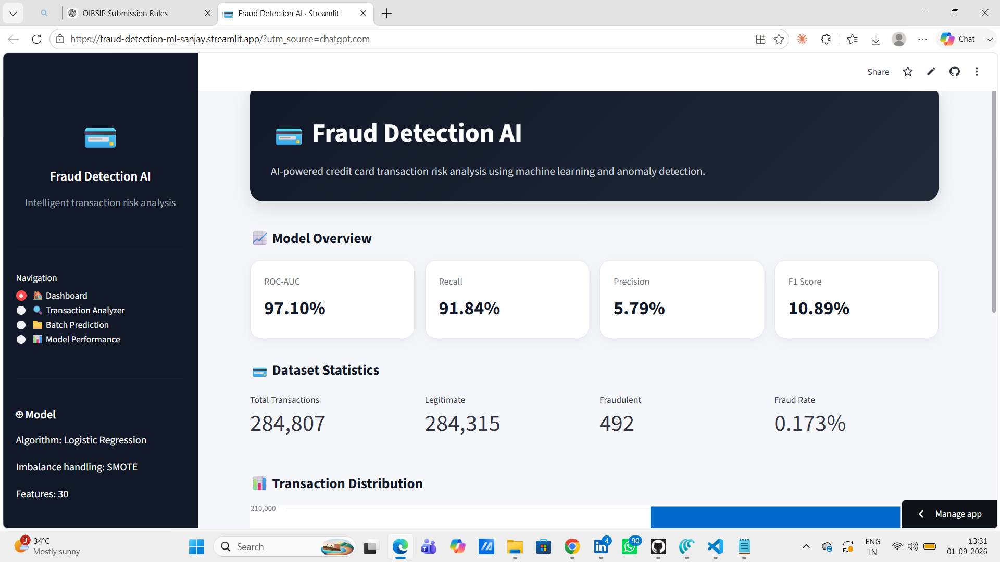
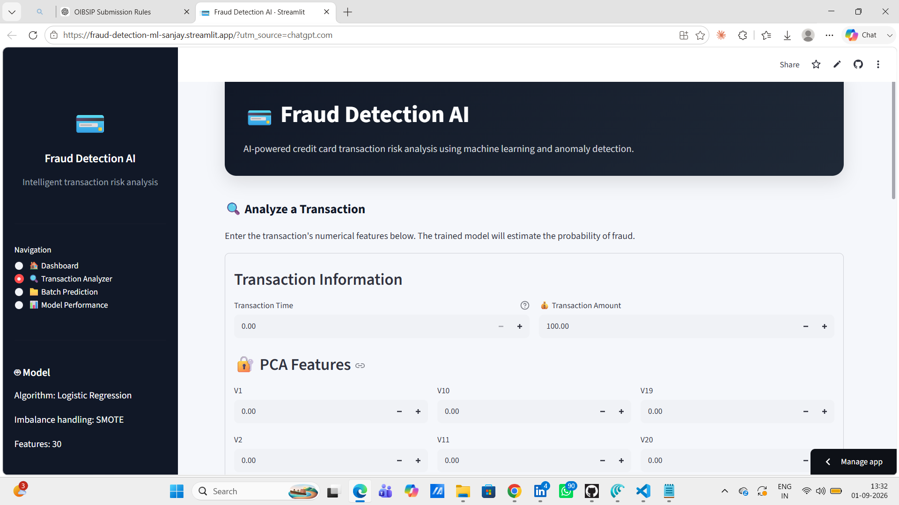
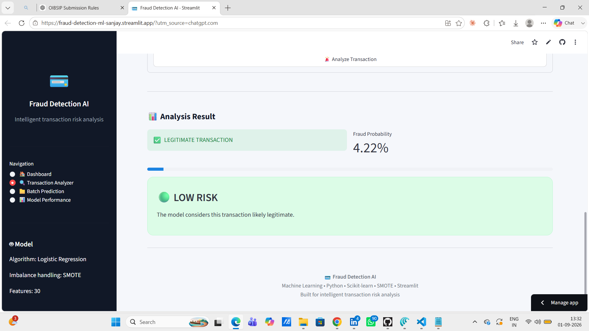
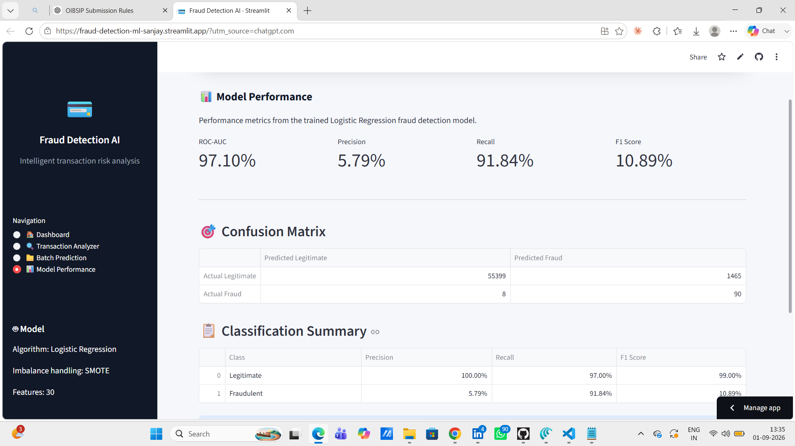

# 💳 Credit Card Fraud Detection System

An AI-powered machine learning application that analyzes credit card transactions and predicts whether a transaction is **legitimate** or **potentially fraudulent**.

The project uses **Logistic Regression**, **StandardScaler**, and **SMOTE** to handle the highly imbalanced fraud-detection dataset, with an interactive **Streamlit** dashboard for real-time predictions.

## 🚀 Live Demo

**Streamlit App:**  
https://fraud-detection-ml-sanjay.streamlit.app/

**GitHub Repository:**  
https://github.com/SanjaykumarBejjanki/Fraud-Detection-ML

---

---

## 📸 Application Screenshots

### 🏠 Dashboard


### 🔍 Transaction Analyzer


### 📊 Fraud Analysis Result


### 📈 Model Performance


---

## 🚀 Live Demo

🌐 **Try the application:**  
https://fraud-detection-ml-sanjay.streamlit.app/

## 👨‍💻 Author

**Sanjay Kumar Bejjanki**

AI & Machine Learning | Python | Data Science | Streamlit

⭐ If you find this project useful, consider giving it a star!
## ✨ Features

- 🔍 Transaction-level fraud prediction
- 🤖 Logistic Regression machine learning model
- ⚖️ SMOTE for handling class imbalance
- 📊 Fraud probability score
- 🚨 Clear fraud/legitimate prediction status
- 🖥️ Professional Streamlit dashboard
- 💾 Saved trained model and scaler using Joblib
- 📈 Model evaluation metrics
- 🐍 Python-based ML pipeline

---

## 🧠 Machine Learning Workflow

```text
Credit Card Transaction Dataset
            │
            ▼
      Data Preparation
            │
            ▼
   Train/Test Split
            │
            ▼
     Standard Scaling
            │
            ▼
          SMOTE
            │
            ▼
   Logistic Regression
            │
            ▼
      Model Evaluation
            │
            ▼
   fraud_model.pkl
            │
            ▼
    Streamlit Dashboard
            │
            ▼
    Fraud Prediction
```

---

## 📊 Dataset

The project uses the well-known **Credit Card Fraud Detection** dataset containing:

- **284,807** total transactions
- **492** fraudulent transactions
- **284,315** legitimate transactions
- **31 columns**
- Target column: `Class`

### Class distribution

| Class | Meaning | Transactions |
|------:|---------|-------------:|
| 0 | Legitimate | 284,315 |
| 1 | Fraudulent | 492 |

Fraud represents approximately **0.173%** of all transactions, making this a highly imbalanced classification problem.

> **Note:** The dataset is not required to be included in the GitHub repository. Keep large/raw datasets outside the repository when possible.

---

## 📈 Model Performance

The current trained Logistic Regression model was evaluated on **56,962 test transactions**.

| Metric | Score |
|--------|------:|
| ROC-AUC | **97.10%** |
| Fraud Precision | **5.79%** |
| Fraud Recall | **91.84%** |
| Fraud F1-Score | **10.89%** |
| Overall Accuracy | **97.00%** |

### Confusion Matrix

```text
                 Predicted
                 Legit   Fraud

Actual Legit     55399    1465
Actual Fraud         8      90
```

### Important interpretation

The model achieves high fraud recall, meaning it identifies most fraudulent transactions in the test set.

However, its fraud precision is relatively low. This means that many legitimate transactions are also flagged as suspicious. In a real financial system, the decision threshold and model would need further tuning to balance fraud detection against false positives.

---

## 🛠️ Technologies Used

- **Python**
- **Pandas**
- **NumPy**
- **Scikit-learn**
- **imbalanced-learn**
- **Joblib**
- **Streamlit**
- **Matplotlib**

---

## 📁 Project Structure

```text
Fraud-Detection-ML/
│
├── app.py
├── requirements.txt
├── README.md
├── .gitignore
│
├── data/
│   └── creditcard.csv
│
├── models/
│   ├── fraud_model.pkl
│   └── scaler.pkl
│
├── outputs/
│   └── metrics.txt
│
└── src/
    └── train.py
```

---

## ⚙️ Installation

### 1. Clone the repository

```bash
git clone https://github.com/SanjaykumarBejjanki/Fraud-Detection-ML.git
cd Fraud-Detection-ML
```

### 2. Create a virtual environment

Windows PowerShell:

```powershell
python -m venv .venv
```

### 3. Activate the environment

```powershell
.\.venv\Scripts\Activate.ps1
```

If PowerShell blocks script execution:

```powershell
Set-ExecutionPolicy -Scope Process -ExecutionPolicy RemoteSigned
.\.venv\Scripts\Activate.ps1
```

### 4. Install dependencies

```bash
python -m pip install -r requirements.txt
```

---

## 🧪 Train the Model

Make sure the dataset is available at:

```text
data/creditcard.csv
```

Then run:

```bash
python src/train.py
```

The training process creates:

```text
models/fraud_model.pkl
models/scaler.pkl
outputs/metrics.txt
```

---

## 🖥️ Run the Streamlit Application

Start the application with:

```bash
python -m streamlit run app.py
```

Streamlit will provide a local address similar to:

```text
http://localhost:8501
```

Open that address in your browser.

---

## 🔎 How to Use the Application

1. Open the Streamlit dashboard.
2. Enter the transaction features.
3. Enter the transaction amount.
4. Click **Analyze Transaction**.
5. The system displays:
   - Prediction status
   - Fraud probability
   - Recommendation message

### Example output

```text
✅ LEGITIMATE TRANSACTION

Fraud Probability: 2.35%
```

or

```text
🚨 FRAUDULENT TRANSACTION

Fraud Probability: 94.21%
```

*The values above are examples only.*

---

## 🔐 Security & Data Considerations

This project is intended for **educational and portfolio purposes**.

It should not be treated as a production banking or financial security system without additional:

- Model validation
- Threshold optimization
- Monitoring
- Data privacy controls
- Security testing
- Bias and drift analysis
- Production infrastructure
- Human review workflows

---

## 🔮 Future Improvements

- [ ] Add multiple ML models such as Random Forest and XGBoost
- [ ] Compare model performance
- [ ] Optimize the classification threshold
- [ ] Improve fraud precision while maintaining strong recall
- [ ] Add ROC and Precision-Recall curves
- [ ] Add transaction history and batch prediction
- [ ] Add model explainability using SHAP
- [ ] Add automated model monitoring
- [ ] Add Docker deployment
- [ ] Add automated CI/CD testing

---

## 👨‍💻 Author

**Sanjay Kumar Bejjanki**

AI & Machine Learning Enthusiast

**GitHub:**  
https://github.com/SanjaykumarBejjanki

---

## ⭐ Support

If you find this project useful, consider giving the repository a ⭐ on GitHub.
